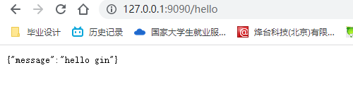
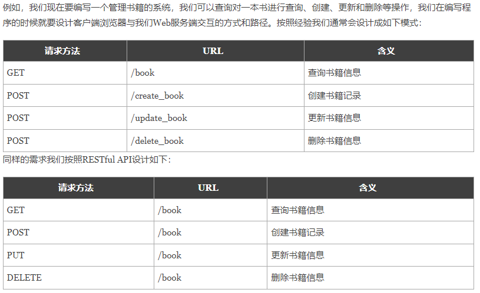

# Gin

## Gin框架安装与使用

下载安装Gin：

```
go get -u github.com/gin-gonic/gin
```

使用示例：

```
package main

import "github.com/gin-gonic/gin"

func main() {
	//创建一个默认的路由引擎
	r := gin.Default()
	//GET:请求方式，/hello:请求路径
	//当客户端以GET方法请求/hello路径时，会执行后面的匿名函数
	r.GET("/hello", func(c *gin.Context) {
		// c.JSON：返回JSON格式的数据
		c.JSON(200, gin.H{
			"message": "hello gin",
		})
	})
	//启动服务，默认端口是8080
	r.Run(":9090")
}
```

启动服务，浏览器访问：



## RESTful API

REST与技术无关，代表的是一种软件架构风格，REST是Representational State Transfer的简称，中文翻译为“表征状态转移”或“表现层状态转化”。

简单来说，REST的含义就是客户端与Web服务器之间进行交互的时候，使用HTTP协议中的4个请求方法代表不同的动作。

- `GET`用来获取资源
- `POST`用来新建资源
- `PUT`用来更新资源
- `DELETE`用来删除资源。



Gin框架支持开发RESTful API的开发。

```
package main

import (
	"github.com/gin-gonic/gin"
	"net/http"
)

func main() {
	// 创建默认引擎
	r := gin.Default()
	//请求编写
	//查询
	r.GET("/book", func(c *gin.Context) {
		c.JSON(200, gin.H{
			"message": "GET",
		})
	})
	//创建
	r.POST("/book", func(c *gin.Context) {
		c.JSON(200, gin.H{
			"message": "POST",
		})
	})
	//修改
	r.PUT("/book", func(c *gin.Context) {
		c.JSON(http.StatusOK, gin.H{
			"message": "PUT",
		})
	})
	//删除
	r.DELETE("/book", func(c *gin.Context) {
		c.JSON(200, gin.H{
			"message": "DELETE",
		})
	})
	//启动HTTP服务
	r.Run()
}
```

## 模板语法template

### HTML渲染

