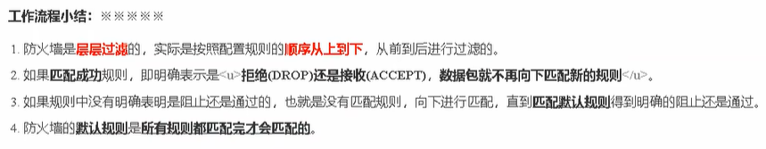
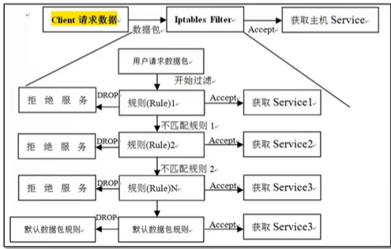
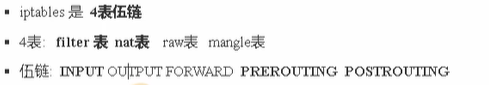
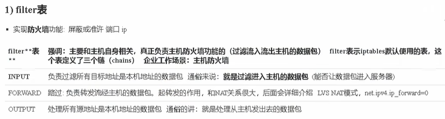
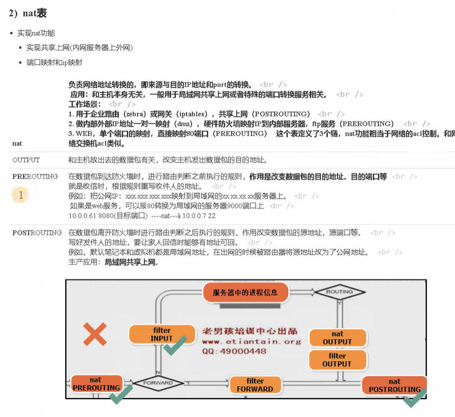
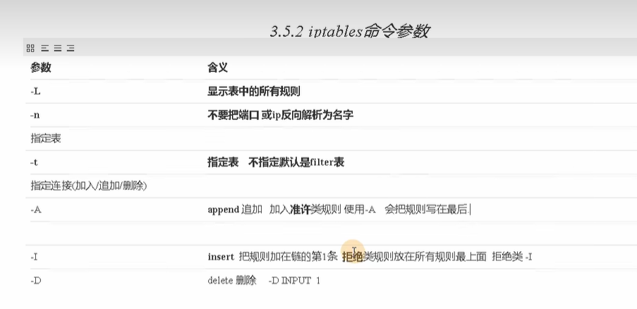
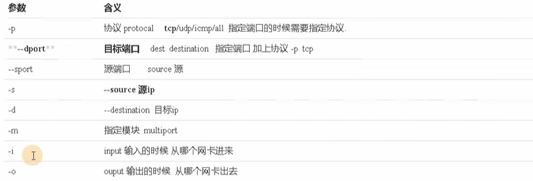
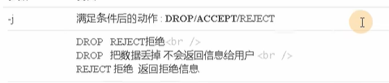

### 常用名词

- 容器：存放东西

- 表(table)：存放链的容器，防火墙的最大概念

- 链(chain)：存放规则的容器

- 规则(policy)：准许或拒绝规则

  

### Iptables处理流程





### 表与链







### Cent OS 7安装Iptables

#### 禁用FirewallD

1. 停止firewalld服务

   ```
   sudo systemctl stop firewalld
   ```

2. 禁用firewalld服务在系统启动时的自启动

   ```
   sudo systemctl disable firewalld
   ```

3. 屏蔽firewalld服务以防止其他服务启动它

   ```
   sudo systemctl mask --now firewalld
   ```


#### 安装并启用Iptables

01、运行以下命令从CentOS存储库安装iptables-service软件包：

```
sudo yum install iptables-services
```

02、软件包安装完成后启动Iptables服务:

```
sudo systemctl start iptables
sudo systemctl start iptables6
```

03、设置Iptables服务为系统启动时服务默认启动:

```
sudo systemctl enable iptables
sudo systemctl enable iptables6
```

04、检查Iptables服务状态:

```
sudo systemctl status iptables
sudo systemctl status iptables6
```

05、通过以下命令检查iptables规则:

```
sudo iptables -nvL
sudo iptables6 -nvL
```

### 环境和命令







```
[root@bogon ~]# iptables -nL //查看当前防火墙规则,默认是filter表
Chain INPUT (policy ACCEPT)
target     prot opt source               destination
ACCEPT     all  --  0.0.0.0/0            0.0.0.0/0            state RELATED,ESTABLISHED
ACCEPT     icmp --  0.0.0.0/0            0.0.0.0/0
ACCEPT     all  --  0.0.0.0/0            0.0.0.0/0
ACCEPT     tcp  --  0.0.0.0/0            0.0.0.0/0            state NEW tcp dpt:22
REJECT     all  --  0.0.0.0/0            0.0.0.0/0            reject-with icmp-host-prohibited

//查看当前防火墙规则，显示规则id
[root@bogon ~]# iptables -nL --line-number
Chain INPUT (policy ACCEPT)
num  target     prot opt source               destination
1    DROP       tcp  --  0.0.0.0/0            0.0.0.0/0            tcp dpt:8080

Chain FORWARD (policy ACCEPT)
num  target     prot opt source               destination

Chain OUTPUT (policy ACCEPT)
num  target     prot opt source               destination

Chain FORWARD (policy ACCEPT)
target     prot opt source               destination
REJECT     all  --  0.0.0.0/0            0.0.0.0/0            reject-with icmp-host-prohibited

Chain OUTPUT (policy ACCEPT)
target     prot opt source               destination

[root@bogon ~]# iptables -t nat -nL  //查看nat表的规则
Chain PREROUTING (policy ACCEPT)
target     prot opt source               destination

Chain INPUT (policy ACCEPT)
target     prot opt source               destination

Chain OUTPUT (policy ACCEPT)
target     prot opt source               destination

Chain POSTROUTING (policy ACCEPT)
target     prot opt source               destination


//清空默认规则：iptables -F
//清空自定义规则： iptables -X
//清空统计与计数：iptables -Z
[root@bogon ~]# iptables -F
[root@bogon ~]# iptables -nL
Chain INPUT (policy ACCEPT)
target     prot opt source               destination

Chain FORWARD (policy ACCEPT)
target     prot opt source               destination

Chain OUTPUT (policy ACCEPT)
target     prot opt source               destination

//添加规则
[root@bogon ~]# iptables -t filter -I INPUT -p tcp --dport 8080 -j DROP
[root@bogon ~]# iptables -nL
Chain INPUT (policy ACCEPT)
target     prot opt source               destination
DROP       tcp  --  0.0.0.0/0            0.0.0.0/0            tcp dpt:8080

Chain FORWARD (policy ACCEPT)
target     prot opt source               destination

Chain OUTPUT (policy ACCEPT)
target     prot opt source               destination

//删除单条规则
[root@bogon ~]# iptables -t filter -D INPUT 1
[root@bogon ~]# iptables -nL --line-number
Chain INPUT (policy ACCEPT)
num  target     prot opt source               destination

Chain FORWARD (policy ACCEPT)
num  target     prot opt source               destination

Chain OUTPUT (policy ACCEPT)
num  target     prot opt source               destination

//
```

### NFQUEUE

#### 介绍

NFQUEUE 是一种 iptables 和 ip6tables 的目标（an iptables and ip6tables target），将网络包处理决定委托给用户态软件。比如，下面的规则将所有接收到的网络包（all packet going to the box）委托给监听中的用户态程序去决策。

```
iptables -A INPUT -j NFQUEUE --queue-num 0
```

用户态软件必须监听队列 0（connect to queue 0），并从内核获取消息；然后给每个网络包给出判决（verdict）。